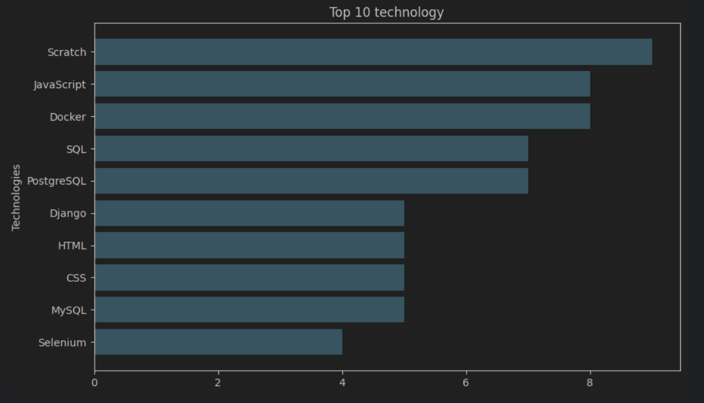

# Scraping-data-analysis


This project scrapes job vacancies from various websites and analyzes the data to provide insights into technology trends and salary expectations. The analysis is performed using Python and the results are visualized using plots.

## Project Structure

- **scraper**: Contains the Scrapy spider to scrape job vacancies from `work.ua`.
- **analysis.ipynb**: Jupyter Notebook for analyzing the scraped data.
- **jobs.csv**: CSV file containing the scraped job vacancies data.

### Data example
[jobs.csv](output/jobs.csv)

### Graphic example



### Installation/getting started

1. Clone the repository:

```shell
git clone https://github.com/BohdanKuzik/workua-Data-Analysis.git
```

2. Create and activate virtual environment:

```shell
# for Windows
python -m venv venv
venv\Scripts\activate
# for macOS/Linux
python3 -m venv venv
source venv/bin/activate
```

3. Install dependencies:

```shell
pip install -r requirements.txt
```

4. Run the scraper script:

```shell
scrapy crawl vacancies
```

5. Open and run the `analysis.ipynb` Jupyter notebook file to perform analytics and generate visualizations.

